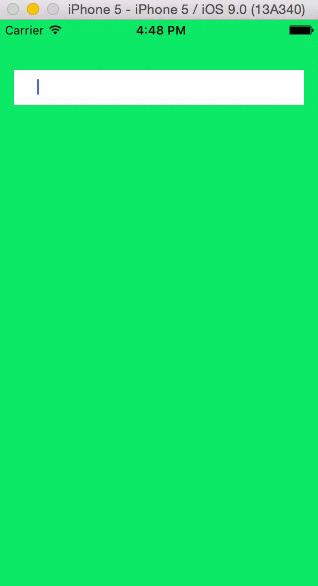
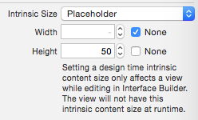

# TFBubbleItUp

[](https://app.bitrise.io/app/eb8c0b3c0b613d79#/builds)
[](http://cocoapods.org/pods/TFBubbleItUp)
[](http://cocoapods.org/pods/TFBubbleItUp)
[](http://cocoapods.org/pods/TFBubbleItUp)



## Usage

Just place UIView in your controller wherever you want and make it as TFBubbleItUpView subclass. It is configured as IBDesignable, so it will show up. The content size is calculated by the view itself, no need to use height constraint. Just set in the Interface builder Intrinsic size to placeholder - width check None and for height choose what suits you best.



There is also a delegate available (named bubbleItUpDelegate, because TFBubbleItUpView is in fact a subclass of UICollectionView) with currently one method **func bubbleItUpViewDidFinishEditingBubble(view: TFBubbleItUpView, text: String)**.

You can preset values with **setItem([TFBubbleItem])** where TFBubbleItem is a struct whose initializer takes string (*TFBubbleItem(text: "Hullo!")*).

If you want to access all items from view, there is method for that **validStrings() -> [String]**. That's because sometimes there are empty items, this method will filter it for you a send you only valid strings.

## Validation
Among all the configuration, there is an ability to validate items before they can be bubbled. There is typealias named Validation which is just a function definition:

```swift
public typealias Validation = String -> Bool
```

Verification function takes a string and returns Bool indicates whether the string is valid or not. These methods should be elementary. There are already two of them available as public classes of TFBubbleItUpValidation - testEmptiness() and testEmailAddress(). These methods returns Validation function and the validation can be called like testEmptiness()("a text"). This technique of translating the evaluation of a function is called [Currying](https://en.wikipedia.org/wiki/Currying). You can provide your own Validation:

```swift
func testSomething() -> Validation {
  return { text in
    return text == "something"
  }
}
```

This allows us to easily combine validation by function TFBubbleItUpValidation.combine(v1: Validation, v2: Validation) or even better with provided operator **|>>**

```swift
let validation = TFBubbleItUpValidation.testEmptiness() |>> TFBubbleItUpValidation.testEmailAddress()
```

The validation can be applied to TFBubbleItUpView via configuration

```swift
TFBubbleItUpViewConfiguration.itemValidation = validation
```

And we can also validate the maximum number of items user can type in by

```swift
TFBubbleItUpViewConfiguration.numberOfItems = .Quantity(5) // default .Unlimited
```

## Configuration

BubbleItUp is highly configurable. There is configuration file called *TFBubbleItUpViewConfiguration* with class variables for configuration.

It is a mix of appearance and functional stuff. I would like to point out **skipOnWhitespace** and **skipOnReturnKey** properties, by them you can change the behaviour of bubble creation around text (see documentation comments bellow).

```swift
/// Background color for cell in normal state
public static var viewBackgroundColor: UIColor = UIColor(red: 0.918, green: 0.933, blue: 0.949, alpha: 1.00)

/// Background color for cell in edit state
public static var editBackgroundColor: UIColor = UIColor.whiteColor()

/// Background color for cell in invalid state
public static var invalidBackgroundColor: UIColor = UIColor.whiteColor()

/// Font for cell in normal state
public static var viewFont: UIFont = UIFont.systemFontOfSize(12.0)

/// Font for cell in edit state
public static var editFont: UIFont = UIFont.systemFontOfSize(12.0)

/// Font for cell in invalid state
public static var invalidFont: UIFont = UIFont.systemFontOfSize(12.0)

/// Font color for cell in view state
public static var viewFontColor: UIColor = UIColor(red: 0.353, green: 0.388, blue: 0.431, alpha: 1.00)

/// Font color for cell in edit state
public static var editFontColor: UIColor = UIColor(red: 0.510, green: 0.553, blue: 0.596, alpha: 1.00)

/// Font color for cell in invalid state
public static var invalidFontColor: UIColor = UIColor(red: 0.510, green: 0.553, blue: 0.596, alpha: 1.00)

/// Corner radius for cell in view state
public static var viewCornerRadius: Float = 2.0

/// Corner radius for cell in edit state
public static var editCornerRadius: Float = 2.0

/// Corner radius for cell in invalid state
public static var invalidCornerRadius: Float = 2.0

/// Height for item
public static var cellHeight: Float = 25.0

/// View insets
public static var inset: UIEdgeInsets = UIEdgeInsetsMake(5, 5, 5, 5)

/// Interitem spacing
public static var interitemSpacing: CGFloat = 5.0

/// Line spacing
public static var lineSpacing: CGFloat = 5.0

/// Keyboard type
public static var keyboardType: UIKeyboardType = UIKeyboardType.EmailAddress

/// Keyboard return key
public static var returnKey: UIReturnKeyType = UIReturnKeyType.Done

/// Field auto-capitalization type
public static var autoCapitalization: UITextAutocapitalizationType = UITextAutocapitalizationType.None

/// Field auto-correction type
public static var autoCorrection: UITextAutocorrectionType = UITextAutocorrectionType.No

/// If true it creates new item when user types whitespace
public static var skipOnWhitespace: Bool = true

/// If true it creates new item when user press the keyboards return key. Otherwise resigns first responder
public static var skipOnReturnKey: Bool = false

/// Number of items that could be written
public static var numberOfItems: NumberOfItems = .Unlimited

/// Item has to pass validation before it can be bubbled
public static var itemValidation: Validation? = nil
```

## Requirements

TFBubbleItUp uses Swift 5.0. Target deployment iOS 10.0 and higher.

## Installation

TFBubbleItUp is available through [CocoaPods](http://cocoapods.org). To install
it, simply add the following line to your Podfile:

```ruby
pod "TFBubbleItUp"
```

## Author

Ales Kocur, aleskocur@icloud.com

## License

TFBubbleItUp is available under the MIT license. See the [LICENSE](LICENSE) file for more info.
